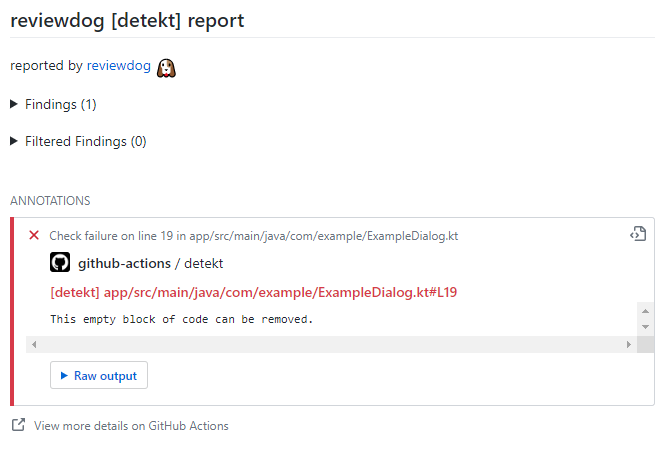
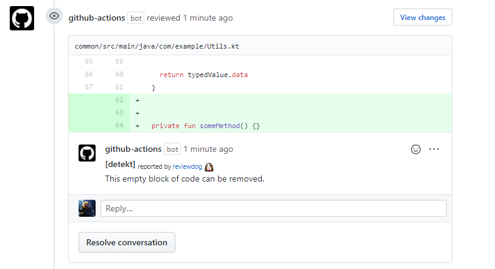

# Github Action for running detekt with reviewdog


This action allows running [detekt](https://github.com/detekt/detekt)
with [reviewdog](https://github.com/reviewdog/reviewdog) on pull requests

## Examples

### `github-pr-check` - used by default

`reviewdog_reporter: github-pr-check`  
`github-pr-check` reporter reports results
to [GitHub Checks](https://github.com/reviewdog/reviewdog#reporter-github-checks--reportergithub-pr-check)



### `github-pr-review`

`reviewdog_reporter: github-pr-review`  
`github-pr-review` reporter reports results to GitHub PullRequest review comments.



## Inputs

This action has several inputs you may be interested in:

### `github_token`

**Required.** Must be in form of `github_token: ${{ secrets.github_token }}`.

### `reviewdog_level`

Optional. Report level for reviewdog's `github-pr-check` reporter [`info`,`warning`,`error`].  
It's same as `-level` flag of reviewdog.
The default is `error`.

### `reviewdog_filter`

Optional. Filter mode for reviewdog. [`added `,`diff_context`,`file`,`nofilter`]  
It's same as `-filter-mode` flag of reviewdog.  
The default is `added`.

[Read more](https://github.com/reviewdog/reviewdog#filter-mode)

### `reviewdog_reporter`

Optional. Reporter for reviewdog. [`github-pr-check`,`github-pr-review`]  
The default is `github-pr-check`.

[Read more](https://github.com/reviewdog/reviewdog#reporters)

### `detekt_config`

Optional. Path to the config file for detekt.  
The default is `default-detekt-config.yml`

[Read more](https://detekt.github.io/detekt/cli.html)

### `detekt_excludes`

Optional. Globing patterns describing paths to exclude from the analysis.  
The default is `**/build/**,**/.idea/**`

[Read more](https://detekt.github.io/detekt/cli.html)

### `fail_on_error`

Optional. Fails the current check if any error was found [`true`/`false`]  
The default value is `true`.

### `detekt_plugins`

Optional. Additional plugins for detekt.  
Should be defined with comma separation `detekt_plugins: 'path/1.jar,path/2.jar'`  
The default value is empty.

[Read more](https://detekt.github.io/detekt/cli.html)

### `detekt_baseline`

Optional. Provides baseline.xml file to detekt.  
The default value is empty.

[Read more](https://detekt.github.io/detekt/cli.html)

### `detekt_parallel`

Optional. Executes detekt in parallel.  
The default value is empty.
To enable declare `detekt_parallel: true`

[Read more](https://detekt.github.io/detekt/cli.html)

### `detekt_build_upon_default_config`

Optional. Preconfigures detekt with a bunch of rules and some opinionated defaults
for you.  
Allows additional provided configurations to override the
defaults.  
To enable declare `detekt_build_upon_default_config: true`

[Read more](https://detekt.github.io/detekt/cli.html)

### `detekt_all_rules`

Optional. Activates all available (even unstable) rules.  
The default value is empty.
To enable declare `detekt_all_rules: true`

[Read more](https://detekt.github.io/detekt/cli.html)

### `detekt_input`

Optional. Specify explicit inputs to detect-cli.
Inputs provided as a comma-separated string.

[Read more](https://detekt.github.io/detekt/cli.html)

## Usage

Following example runs detekt with

```yml
name: reviewdog
on: [ pull_request ]

jobs:
  detekt:
    name: Check Code Quality
    runs-on: ubuntu-latest

    steps:
      - name: Clone repo
        uses: actions/checkout@v2
        with:
          fetch-depth: 1
          ref: ${{ github.head_ref }}

      - name: detekt
        uses: alaegin/Detekt-Action@v1.23.7
        with:
          github_token: ${{ secrets.github_token }}
          detekt_config: detekt-config.yml # Change config path
```

## License

[MIT](LICENSE)

## Inspiration

* [action-ktlint](https://github.com/ScaCap/action-ktlint) - Action for running ktlint with reviewdog
